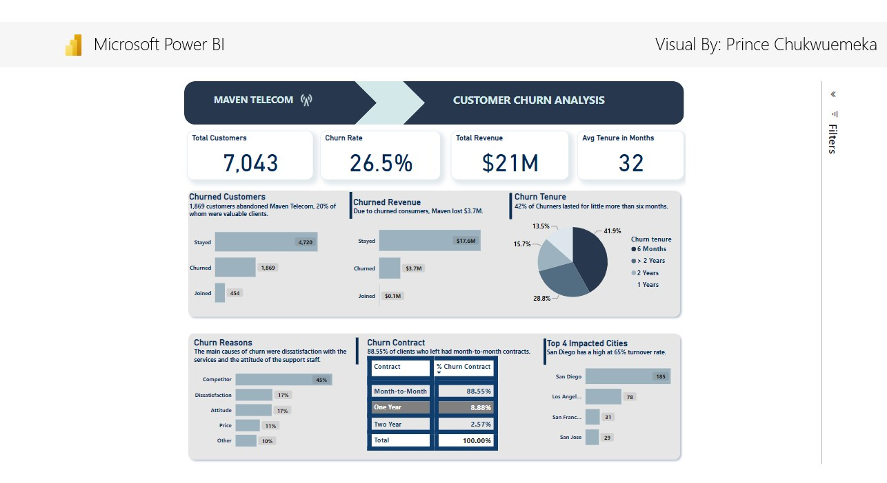

# **Customer Churn Analysis Using Power BI**

## 1. **INTRODUCTION**
Customer churn is not merely a statistic or a metric; it represents a missed opportunity and a potential warning sign for any business. When customers decide to discontinue their relationship with a company, it not only affects revenue and profitability but also has broader implications for brand reputation, customer loyalty, and overall growth. 
In this project, I will explore the multifaceted nature of customer churn and its implications. We will examine the underlying reasons behind churn, such as subpar customer experiences, lack of personalization, and failure to meet evolving customer needs. By understanding these root causes, we can begin to address them head-on and develop proactive strategies to mitigate churn rate.

## 2. **Problem Statement: Churn Analysis**
The problem at hand is to analyze customer churn for a company and develop a predictive model that can identify customers who are most likely to churn. The goal of this analysis is to understand the factors that contribute to customer churn and develop a model that can accurately predict churn behavior. By identifying customers who are at a high risk of churning, the company can proactively take actions to retain them, such as offering personalized incentives, improving customer service, or enhancing the value proposition of their products or services.

The following imperative tasks must be completed in order to address this issue:
- Data Preparation and Cleaning
- Exploratory Data Analysis and Data Insights
- Recommendation for Retaining Customers
- Data Visualization
  
## 3.**Data Cleaning and Preparation** 

- I replaced all null values with "0" or "NA" depending on the column.
- I also changed some of the datatypes for all the non-quanlative numerical columns to text data types.
- To track Churn tenure, I introduced a conditional column.
  
    
   
 *applied_step*   
 

*conditional_column*

## 4. **Exploratory Analysis**
In total, there are 7,043 customers.

**How much revenue was lost to churned customers?**

Maven lost 1869 clients, who were responsible for 17% of its overall income. It's a significant number.

 
      
*DAX to count the total churn* 

*DAX to calculate the % churn on revenue*

  
*Outcome*

**How Long does customers stay before churning?**

I used the Conditional column function in Power query to determine how long consumers normally stay at Maven before departing. 
I discovered that 42% of consumers who left Maven within 6 months or less.

*conditional_column*

*Churn Tenurn*

**What cities have the greatest rates of Churn?**

Maven Telecom should be concerned because these two cities account for half of their client base in each, with **San Diego** having the highest churn rate at 185 and **Los Angeles** coming in at 78.

**What are the reasons for churn?**

Customers' discontent with Maven's service offerings, Competitors superior service offerings, and Attitude support Staffs are the main causes of turnover.
Out of the overall 1,869 churned customers.
- Competitors stole 841 (45%) of Maven's customers by providing superior services including fiber optics and Premium Tech Support.
- Because of customers dissatisfaction with the services provided by Maven, 321 (17%) customers churned.
- 314 (16%) customers left due to the attitude of the support staff.
- Although price churned away 211 (11%) consumers. These numbers are enormous, and as a result, the business must take decisive steps in order
  to retain a sizable consumer base.

## 5. **Recommendation on Customer Retention**

🌟 Enhance customer retention strategies: Develop targeted retention programs that focus on reducing churn rate. Consider implementing personalized offers, loyalty rewards, or proactive customer support to improve customer satisfaction and loyalty.

🌟 Improve customer engagement: Enhance communication strategies across channels such as email, phone calls, and online interactions to deliver personalized and relevant services to customers.

🌟 Invest in enhancing your fiber optic service by giving customers access to higher speeds, more reliable connections, and better customer service.

🌟 Premium Tech Support: Maven should think about providing this service to all customers because those who did not have access to premium 
tech support were more likely to leave.

🌟 After-Sales Service: Schedule routine customer follow-ups to make sure they are still happy with your service. These check-ins might come in the form of questionnaires, calls, or emails.

## 6. **Final Power BI Dashboard**

## 7. **Bonus Dax**
This DAX was written to get the percentage of churned customers

